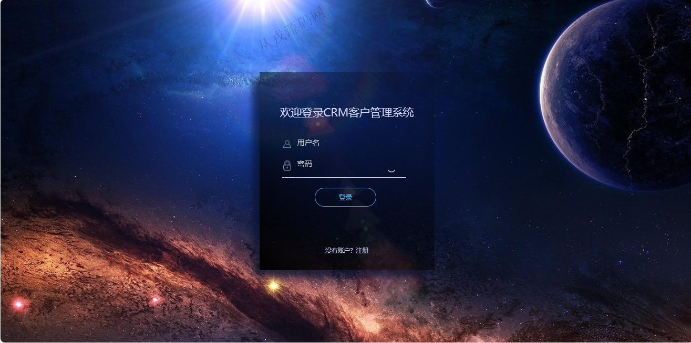
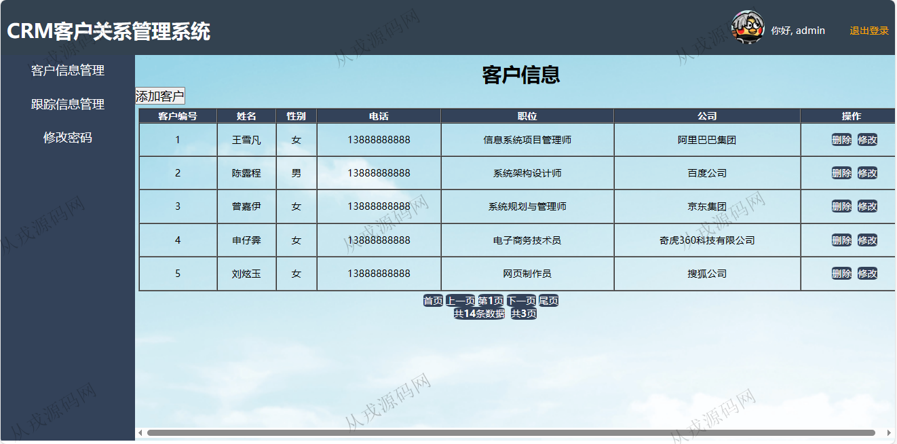
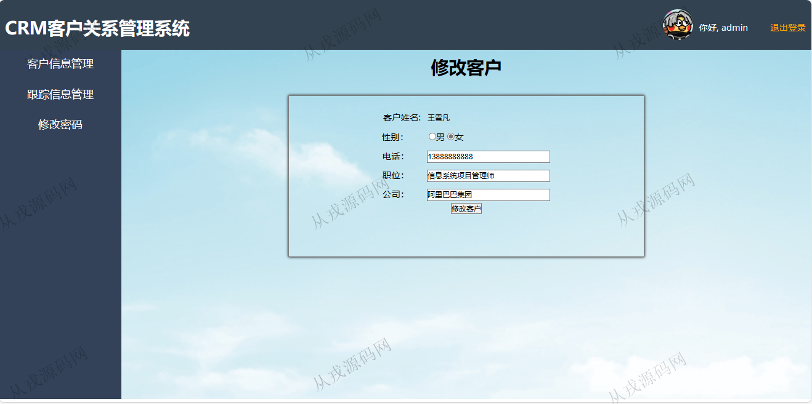
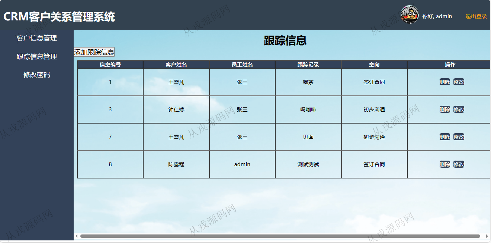
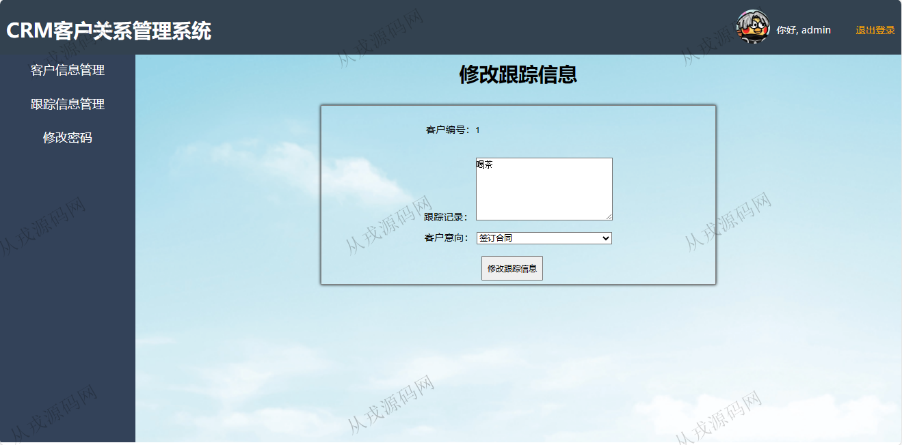
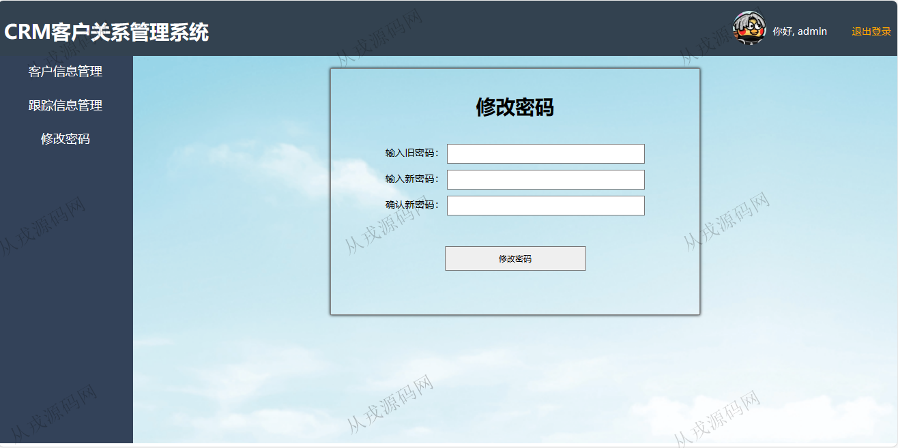

<h1 align="center">212.客户管理系统</h1>

 获取sql文件 QQ: 386869957 QQ群: 377586148 

 [更多源码项目: 从戎源码网](https://armycodes.com/) 

## 简介

> 本代码来源于网络,仅供学习参考使用!
>
> 提供1.远程部署/2.修改代码/3.设计文档指导/4.框架代码讲解等服务
>
> 访问地址：http://localhost:8080/
> 
> admin 123456
>

## 项目介绍
基于ssm的客户管理系统：前端 html、jquery，后端 maven、springmvc、spring、mybatis；角色分为管理员；集成客户信息管理、跟踪信息管理等功能于一体的系统。

## 功能介绍

- 基本功能：登录，注册，退出
- 客户信息管理：客户信息的列表查询，添加客户，修改客户信息，删除客户信息
- 跟踪信息管理：跟踪信息的列表查询，添加跟踪信息，修改跟踪信息，删除跟踪信息
- 密码修改：需要输入原密码才可以修改密码成功

## 环境

- <b>IntelliJ IDEA 2021.3</b>

- <b>Mysql 5.7.26</b>

- <b>Tomcat 7.0.73</b>

- <b>JDK 1.8</b>

## 运行截图

